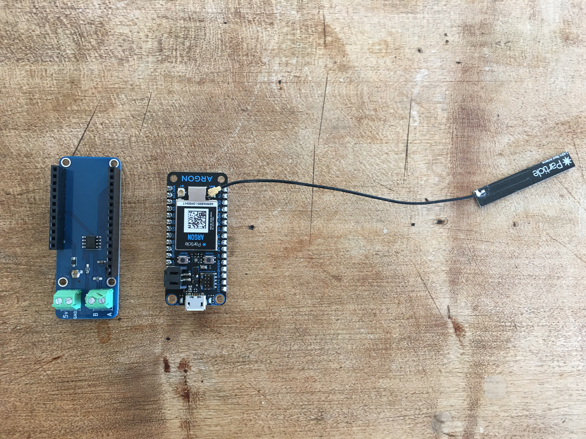

# WekaHR modbus slave holding registers synchronised with google sheets



The WekaHR is a modbus slave (RS-485) with read/write registers that are synced with your google sheet. Your PLC can connect to the WekaHR modbus slave to read and write register values to report data or configure PLC operations.

## Components

* WekaHR featherwing
* a PLC (supplied by you)
* Particle Argon (Wifi) or Boron (cellular) IOT device
* Google Sheet Application

## Connect hardware

1. Wire the WekaHR to your PLC.  The WekaHR is powered by 5v DC. Schnieder PLCs provide 5v via the modbus port
2. Insert the Boron or Argon into the WekaHR
3. Connnect particle Boron or Argon to the particle cloud, and give the device a name (deviceName)

Then you are ready to flash the firmware

## Flash Firmware

Clone this repository, and install the [particle command line tools](https://docs.particle.io/tutorials/developer-tools/cli/)

```
cd WekaHR/firmware/particle_gen3
# compile and flash over WiFi or Cellular
particle flash deviceName 

# or, for usb connected particle
particle compile argon|boron --saveTo=bin
particle serial list
particle serial flash bin
```

## Initial WekaHR module setup, for a fresh new module

Issue these commands to in the particle console (console.particle.io). The modbus baud is set in the code, currently to 19200 8N1
```
SetUnitID 10   # to set modbus slave ID (defaults to 10)
SetEventName "companyname/projectname"   # set the particle webhook event name

```

## Save a copy of the linked google sheet

Save a copy of this [WekaHR Google Sheets Template](https://docs.google.com/spreadsheets/d/1dsoAosavrSCt88q0tjWTA6WfT7lwxBgexuUGqGGjWAQ/copy?usp=sharing) and follow the instructions in the worksheet to connect your particle to the google sheet using a webhook.

## Connect particle cloud to google sheet

Follow the instructions in the google sheet to connect your particle device to the google sheeet using a particle webhook integration.


## Particle API - Functions

#### int ManualUpdate(String args = "")

Trigger a manual JSON packet publish and JSON settings register response.  Running this function ensures that application register values are set in the WekaHR.

#### int PublishUnitID(String args = "")

Publish the current modbus id. Defaults to 10.

#### int SetUnitID(String args = "number 1-247")

Set the device modbus id.

#### int PublishEventName(String args = "")

Publish the current event name.

#### int SetEventName(String args = "eventName")

Set the current event name.  Suggested format is CompanyName/ProjectName, where multiple customer sites may share the same CompanyName and ProjectName.

#### int PublishSettingsJSON(String args)

Publish the current JSON settings saved to EEPROM.  

#### int SetSettingsJSON(String args)

Save string args as current JSON settings to EEPROM.  Use with caution.

## JSON Published to Google Sheet

```
JSON:
{
  "name": "companyname/dairyshed",
  "data": "{\"v\":\"1.0\",\"func\":\"writeLog\",\"addr\":0,\"HR\":[0,0,0,0,0,0,0,0,0,0,0,0,0,0,0,0,0,0,2048,0,0,0,0,0,0,0,0,0,0,0,0,0,0,0,0,0,0,0,0,0,0,0,0,0,0,0,0,0,0,0,0,0,0,0,0,0,0,0,0,0,0,0,0,0,0,0,0,0,0,0,0,0,0,0,0,0,0,0,0,0]}",
  "ttl": 60,
  "published_at": "2019-10-20T01:54:46.580Z",
  "coreid": "coreid"
}

the data key, when interpreted as JSON:
{"v":"1.0","func":"writeLog","addr":0,"HR":[0,0,0,0,0,0,0,0,0,0,0,0,0,0,0,0,0,0,2048,0,0,0,0,0,0,0,0,0,0,0,0,0,0,0,0,0,0,0,0,0,0,0,0,0,0,0,0,0,0,0,0,0,0,0,0,0,0,0,0,0,0,0,0,0,0,0,0,0,0,0,0,0,0,0,0,0,0,0,0,0]}


```

Version "v" key, "v" = "1.0", where 1.0 could be anything < 2.0.  (eg 1.1,1.2, etc)
The holding registers are given as an array, starting at address "addr".
HR = [javascript array].  The current length of the array is 80 [registers addr + 0 to addr + 79], but could be anything from length 1-100.

The WekaHR accepts a JSON response that sets HR values.  The response looks like:

```

{"40":1,"41":2,"42":3,"43":0,"44":0,"45":0,"46":0,"47":0,"48":0,"49":0,"50":0,"51":0,"52":0,"53":0,"54":0,"55":0,"56":0,"57":0,"58":0,"59":0,"60":0,"61":0,"62":0,"63":0,"64":0,"65":0,"66":0,"67":0,"68":0,"69":0,"70":0,"71":0,"72":0,"73":0,"74":0,"75":0,"76":0,"77":0,"78":0,"79":12,"sheet":"https://docs.google.com/a/xxx.xxx.xxx/spreadsheets/d/yyyyyyyyyyyyyyyyyyyyyyyyyyyyyyyyyyyyyyyy/edit","row":38}

```

This includes registers set and their numeric value to be set, as well as the source google sheet or application url.

## Licenses

* Hardware: CERN-OHL-P
* Firmware: MIT
* Documentation: MIT